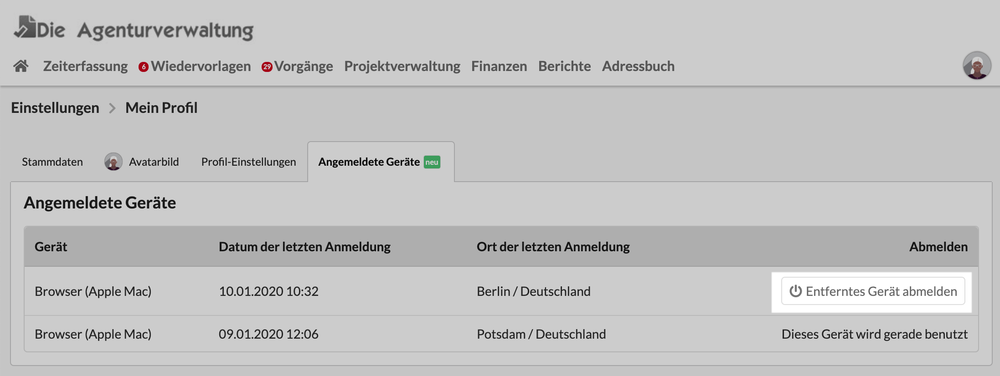

# Anmelden und Abmelden

## Anmeldung mit E-Mail-Adresse und Passwort

## Abmeldung \(Logout\)

Im Einstellungsmenü rechts oben auf der Seite  \(es klappt auf klick auf\) befindet sich ein Button "Maria Muster abmelden". Dieser Button zeigt einerseits an, wer gerade angemeldet ist \(indem dein Name dort steht\), andererseits führt ein Klick darauf dazu dass dieser Browser abgemeldet wird.

### Abmeldung von entfernten Geräten

Wenn Du dich beispielsweise gestern in einem Internetcafé auf einem öffentlichen Browser angemeldet  und vergessen hast, dich wieder abzumelden, kannst Du das in deinem Profil tun.

Dazu klickst du wieder auf das Einstellungsmenü \(oben rechts\) und dann auf "Einstellungen". Im nächsten Schritt klickst Du auf die Kachel "Mein Profil". Dort öffnest du den Reiter "Angemeldete Geräte". Hier kannst Du dich mit einem Klick von dem \(entfernten\) Gerät abmelden, in diesem Beispiel vom entfernten Rechner eines Internetcafés in Berlin.

## Passwort setzen

#### Passwort-vergessen Funktion nutzen

#### Eigenes Passwort neu setzen

#### Passwort-Reset-E-Mail an andere Benutzer senden

#### Neuen Benutzer einladen sein Passwort selbst zu erstellen

## Wissenswertes zu Passwörtern

* Das Passwort sollte lang sein, mind. 10-15 Zeichen.
* Das Passwort sollte nirgendwo im Klartext notiert werden.
* Das Passwort sollte niemand anderem als dem Nutzer bekannt sein.
* Das Passwort sollte neben Buchstaben auch Zahlen und Sonderzeichen enthalten.
* Für jede Applikation sollte ein eigenes Passwort verwendet werden.
* Passwörter können in einem geeigneten Passwort-Safe z.B. 1Password organisiert werden.
* Das Passwort sollte gelegentlich - z.B. alle paar Wochen oder nach Aufforderung durch den Systemadministrator - geändert werden.

