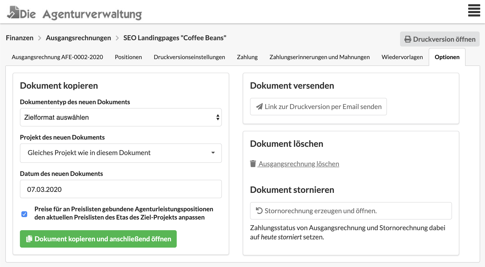

# Dokument kopieren oder in anderes Dokument umwandeln

In Kostenvoranschlägen, Ausgangsrechnungen, Gutschriften und Vorlagen gibt es im Reiter "Optionen" die Möglichkeit das gesamte Dokument zu kopieren:

Das ausgewählte Zielformat entscheidet dabei was für ein Dokument man erzeugt \(z.B. Kostenvoranschlag oder Vorlage\).

Projekt und Datum können vor der Erstellung des Dokuments definiert werden, da sich daraus je nach Konfiguration eures Unternehmens die Dokumentennummer \(z.B. die Rechnungsnummer\) ergibt.

## Automatische Anpassung der Preise beim Kopieren in Projekte mit anderen Preislisten

Eine Änderung des Projekts beim neu erzeugten Dokument kann zur Folge haben, dass die Preise im Zielprojekt andere sind als im Projekt in dem unser Dokument gerade liegt.


**Ein Beispiel**

Unser Kostenvoranschlag für Kunde A hat 12 h Grafikdesign zu 90 EUR kalkuliert. Wir kopieren diesen Kostenvoranschlag nun in ein Projekt von Kunde B. Mit Kunde B sind jedoch nur 75 EUR für eine Grafikdesignstunde vereinbart.   
  
In diesem Fall lassen wir die Checkbox "Preise .... anpassen" unterhalb des Kopieren-Dialogs angehakt und die Preise unseres Dokuments werden beim Kopieren automatisch an die Preisliste des Ziel-Etats angepasst.


