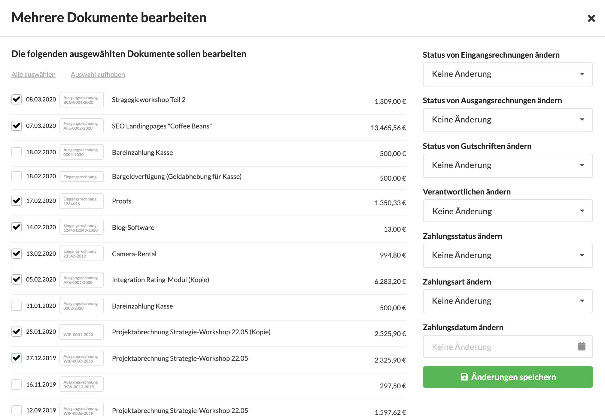

# Export der Finanzbuchhaltungsdaten

## Suchfilter und Listentypen

In dieser Liste werden alle Buchungen, also Eingangsrechnungen \(Lieferantenbelege\), Ausgangsrechnungen \(also Akonto-, Teil- und Schlussrechnungen, Stornorechnungen\) sowie Gutschriften gemeinsam aufgeführt.

Die Liste ist auf einen Zeitraum einschränkbar - z.B. den letzten Monat.

Die Liste kann nach drei Kriterien erstellt werden:

#### Alle Buchungen mit Zahlungsverkehr nach Zahlungsdatum

Diese Einstellung zeigt nur Dokumente die bezahlt wurden und deren Zahlungsdatum in das ausgewählte Zeitfenster fällt. Das macht z.B. Sinn wenn eine Ist-Versteuerung stattfindet, also nach Zahlungsdatum versteuert wird.

#### Alle Buchungen nach Rechnungsdatum

Diese Einstellung zeigt alle Dokumente unabhängig davon ob sie bezahlt wurden oder nicht. Ausgangsrechnungen und Gutschriften müssen sich im Status "versandt" befinden um hier mit ausgegeben zu werden.

#### Alle Buchungen deren Leistungszeitraum im ausgewählten Zeitfenster beginnt oder endet

Bei dieser Ansicht bleibt auch unerheblich ob eine Rechnung bezahlt wurde oder nicht. Entscheidend ist dass ihr Leistungszeitraum mindestens teilweise in den Zeitraum des ausgewählten Zeitfensters fällt.  
Ausgangsrechnungen und Gutschriften müssen sich im Status "versandt" befinden um hier mit ausgegeben zu werden.

#### 

## Export aller Seiten dieser Liste

Unterhalb der Liste können zwei Optionen für den DATEV-Export aller Einträge der Liste - einschliesslich der nicht sichtbaren Einträge bei mehrseitigen Listen - ausgewählt werden.

### DATEV Export ohne Projektzuordnungen

Hiermit erzeugst du eine für DATEV und viele andere Buchhaltungsprogramme lesbare CSV-Datei mit den Buchungsdaten für den ausgewählten Zeitraum, sortiert und gefiltert wie in der Ansicht.  
Die Datei kann auch mit einem Tabellenkalkulationsprogramm z.B. Excel geöffnet werden.

### DATEV Export mit Projektzuordnungen

Diese Option, erzeugt eine ebenso importierbare Datei. Dabei werden für Eingangsrechnungen die auf mehrere Projekte verbucht wurden auch mehrere Buchungszeilen erzeugt.  
Ausgangsrechnungen und Gutschriften können nur einer Projektnummer zugeordnet werden und werden entsprechend nur mit einer Buchungszeile repräsentiert, die dann aber auch die Projektnummer enthält.

**Beispiel:**

Die Lektoratsrechnung mit der Nummer 12345 und dem Betrag 500,- Euro wird auf Projekt A mit 300,- EUR und auf Projekt B mit 100,- EUR verbucht. Die verbleibenden 100,- EUR werden keinem Projekt zugewiesen.

Es entstehen drei Buchungszeilen:

| Betreff | Rechnungsnummer | Projekt | Betrag |
| :--- | :--- | :--- | :--- |
| Lektoratsrechnung | 12345 | Projekt A | 300,00 |
| Lektoratsrechnung | 12345 | Projekt B | 100,00 |
| Lektoratsrechnung | 12345 |  | 100,00 |


Die letzte Zeile entfällt wenn die Eingangsrechnung vollständig, also zu 100% auf Projekte verbucht wurde.


## Stapelverarbeitung: Mehrere Einträge gleichzeitig bearbeiten

Über die Stapelverarbeitungsfunktion können mehrere Einträge der gerade angezeigten Liste in einem Schritt bearbeitet werden.

Es öffnet sich ein Dialog in dem ich in der Listenansich der linken Spalte Dokumente auswählen kann und im Formular in der rechten Spalte entscheide, welche Eigenschaften des Dokuments sich ändern sollen.


**Anwendungsbeispiel**  
Auf diese Weise können z.B. alle Buchungen, die am Monatsende an das Steuerberatungsbüro übertragen werden, in einem Schritt auf den Status "gebucht" umgestellt werden, damit sie in weiteren Verlauf nicht mehr von anderen Nutzern geändert werden.


