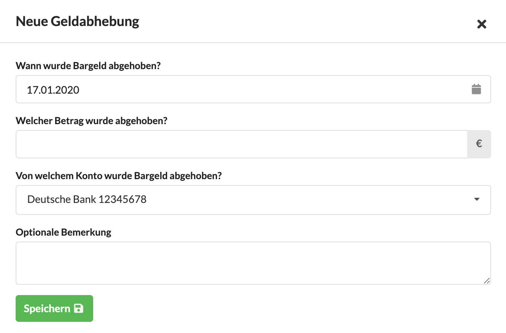

# Kassenbuch für Bargeldverkehr

Die meisten Agenturen verwalten eine kleinere Menge von Bargeld für alltäglichen Ausgaben für Büromaterial oder Vorräte in der Teeküche oder kleinere Reisekostenauslagen. Die Agenturverwaltung hilft dabei, den Bestand dieser Bargeldkasse in einem Kassenbuch zu verwalten. Das Kassenbuch erreicht man über das Hauptmenü Finanzen &gt; Kassenbuch.

Es zeigt eine Liste aller bar bezahlten Ein- und Ausgangsrechnungen sowie Gutschriften an. Unbezahlte Rechnungen tauchen hier nicht auf.

Oberhalb des Kassenbuchs wird der Saldo angezeigt. Das ist die Summe aller bisher bar bezahlten Ein- und Ausgaben. 


**Hinweis**  
Die Beträge in den Spalten Soll und Haben zeigen den tatsächlich _gezahlten_ Betrag an, der vom Rechnungsbetrag abweichen kann, z.B. wenn der gezahlte Betrag nicht korrekt war.


### Wie kommt Geld in die Kasse?

Bargeld kann über eine bar bezahlte Rechnung eines Kunden in die Kasse gelangen. Überlicherweise wird jedoch eine Kasse in einer Agentur mit Bargeld befüllt indem jemand zur Bank oder zum Geldautomaten geht und Geld abhebt. Oberhalb der Liste befindet sich dafür ein Button "Neue Geldabhebung". Dieser öffnet einen Dialog, in dem der abgehobene Betrag, das Datum und das Konto von dem das Geld abgehoben wurde angegeben werden.

Beim Speichern wird dann   
a\) eine Eingangsrechnung mit dem Betreff "Barverfügung" und dem angegebenen Betrag auf dem ausgewählten Konto \(z.B. dem Giro oder einem Kreditkartenkonto\) erstellt und gleichzeitig   
b\) eine Ausgangsrechnung mit dem Betreff "Barverfügung" erzeugt.   
Beide Buchungen werden zum angegebenen Datum der Abhebung auf "bezahlt" gesetzt und finden sich in der Liste der Ein- bzw. Ausgangsrechnungen wieder. Im Kassenbuch wird nur die entsprechende Ausgangsrechnung als "Bareinzahlung" angezeigt.

### Was wenn der Barbestand nicht mit dem Saldo des Kassenbuchs übereinstimmt?

Üblicherweise wird dann eine Korrekturbuchung vorgenommen, z.B. "Übertrag 12.04.2020". Oder "Schwund". Geht es um eine Verlust-Buchung wird dazu eine Eingangsrechnung erstellt und über den Reiter Zahlung auf "bezahlt heute, bar" gestellt.

Ist zuviel Geld in der Kasse kann eine Ausgangsrechnung mit einem geeigneten Betreff erzeugt werden. Diese Buchungen sind leistungsfrei und sollten keine Mehrwertsteuer enthalten.  

