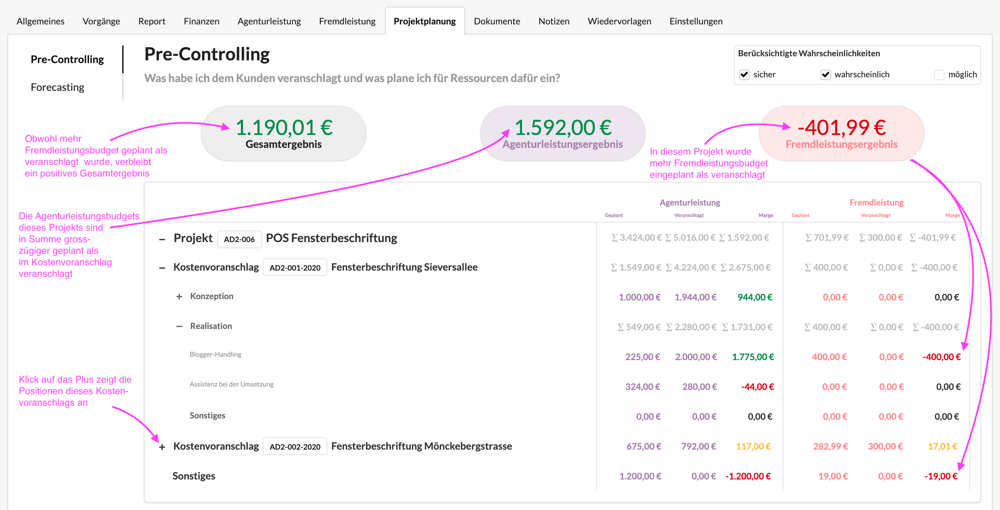
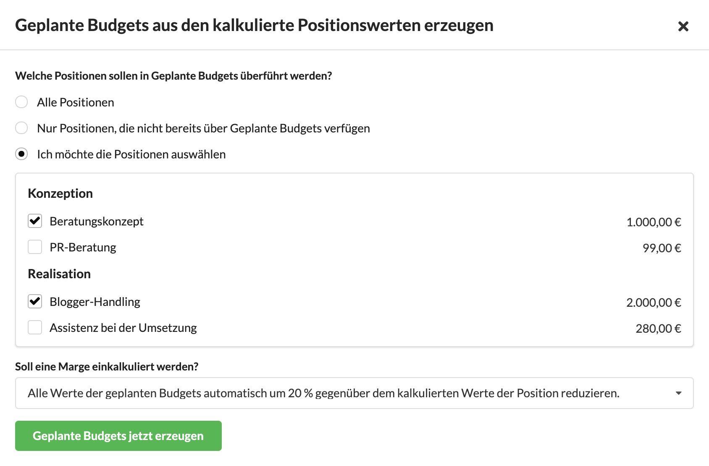

# Pre-Controlling

Unter Pre-Controlling verstehen wir in diesem Fall die Gegenüberstellung zwischen dem was ich als Leistung in einem Projekt intern eingeplant habe und dem was ich dem Kunden im Kostenvoranschlag kalkuliert habe, denn diese Werte können ggf. stark voneinander abweichen.

Diese Liste erlaubt uns, zu überprüfen, ob wir für jede kalkulierte Position eine ausreichende Marge erzielen werden.

## Geplante Budgets automatisch aus KV-Positionen erzeugen

Mit der Schaltfläche unterhalb dieser Liste können wir einen Assistenten öffnen, der uns dabei hilft automatisch aus allen kalkulierte Positionen eines Kostenvoranschlags Geplante Budgets zu erzeugen. Anschliessend können diese Budgets im Tab "Forecasting" bearbeitet werden.

Wir können an dieser Stelle auswählen, ob Budgets für alle Positionen, Positionen die nicht bereits über ein Geplantes Budget verfügen oder nur bestimmte Positionen erzeugt werden sollen.

Es ist möglich, automatisch eine Marge in die zu erzeugenden geplanten Budgets einzukalkulieren. Wähle ich wie im Beispiel oben z.B. 20 % aus, würden z.B. zwei Geplante Budgets angelegt werden:  
1. Beratungskonzept 800 EUR  
2. Blogg-Handling 1600 EUR  
  
Waren diese Positionen im Kostenvoranschlag mit bestimmten Funktionen \(z.B. "Beratung"\) verknüpft, werden diese Funktionen auch in die Geplanten Budgets übernommen.   
Waren in unsererm Beispiel z.B. 10 Beraterstunden zu 100 EUR kalkuliert, enthält unser Geplantes Budget für diese Position nur noch 8 Beraterstunden, da eine Marge von 20% vom verfügbaren Budget abgezogen wurde.  
  
Eintrittswahrscheinlichkeit und Leistungszeitraum eines auf diesem Weg aus einem Kostenvoranschlag erzeugten Geplanten Budgets entsprechem der Wahrscheinlichkeit und dem Lieferzeitraum des Kostenvoranschlags.

