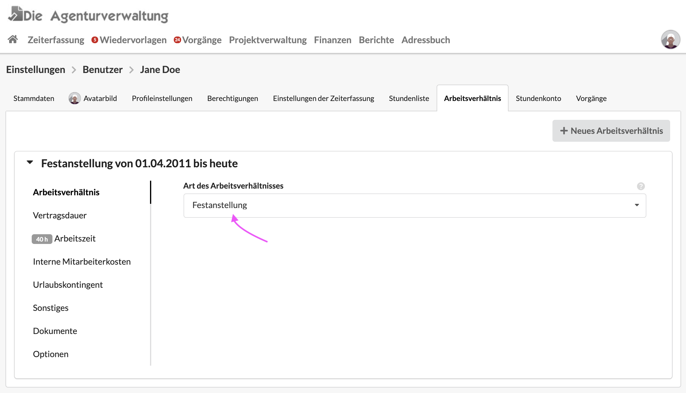
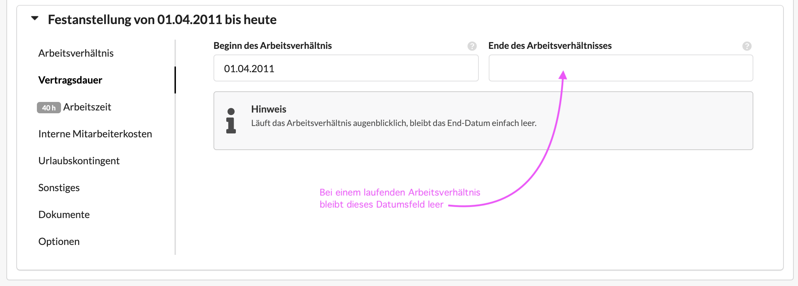
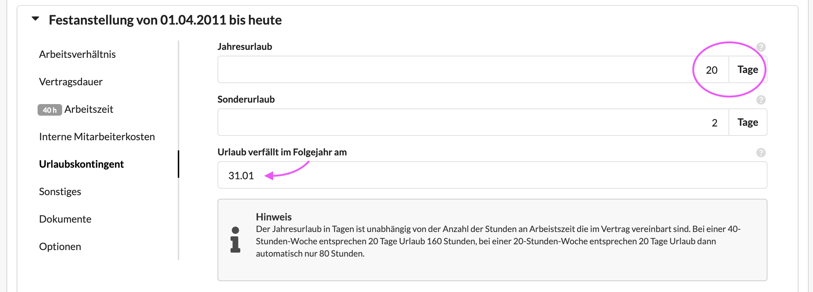
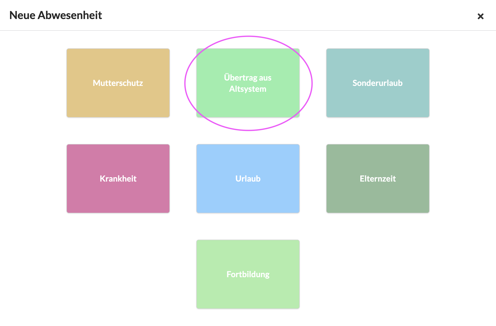

# Resturlaub aus Altsystem übertragen

Um Resturlaub aus einem abzulösenden Drittsystem in Die Agenturverwaltung zu migrieren, kann wie folgt vorgegangen werden:

### **Voraussetzung**

* Für jeden Mitarbeiter ist klar, wieviel Tage Urlaubskontingent aus seinem Arbeitsvertrag hervorgehen und wieviel Urlaub er im laufenden Jahr bereits genommen hat.
* Für jeden Mitarbeiter ist klar, zu welchem Datum Resturlaub verfällt \(z.B. am 31.03 des laufenden Jahres\)
* Für jeden Mitarbeiter ist wieviel Resturlaub er aus dem Vorjahr mitnimmt.

### Konfiguration der Arbeitsverträge

Urlaubskontingente können nur für Mitarbeiter mit einem Arbeitsverhältnis "Festanstellung" konfiguriert werden

#### Beginn des Arbeitsverhältnisses

Unabhängig vom tatsächlichen Beginn des Arbeitsvertrages wird das Arbeitsverhältnis zum 01.01 des laufenden Jahres \(oder falls der Mitarbeiter erst im laufenden Jahr zu uns gestossen ist zum tatsächlichen Datum des Beginns des Arbeitsvertrages\) gestartet.

Die kann in den Benutzer-Einstellungen im Reiter Arbeitsverhältnis unter Vertragsdauer eingestellt werden.  
Bei einem laufenden Arbeitsverhältnis wird das End-Datum einfach leer gelassen. 

#### Urlaubskontingent hinterlegen

Im Reiter "Arbeitsverhältnis" unter "Urlaubskontingent" kann angegeben werden wieviele Tage Urlaubsanspruch ein MItarbeiter im Jahr hat.

**Achtung**: Hier werden volle Tage angegeben, unabhängig davon ob ein Mitarbeiter eine volle oder eine Teilzeistelle hat.


**Zwei Beispiele**  
Irene arbeitet Mo - Do und hat Freitags immer frei. Sie hat also eine 80%-Stelle.  
Sie hat 30 Tage Urlaubsanspruch im Jahr, dieser bezieht sich aber auf 80% - das bedeutet  
30 Tage \* 8 Stunden \* 80 % = 192 h **das entspricht 24 Tage zu 8   
  
Am Arbeitverhältnis werden jedoch 30 Tage hinterlegt**. Die Agenturverwaltung errechnet die Anzahl in Stunden automatisch.  
  
Markus arbeitet 5 Tage die Woche halbtags. Er hat also eine 50%-Stelle.  
Er hat 22 Tage Urlaubsanspruch im Jahr, dieser bezieht sich aber auf 50% - das bedeutet  
22 Tage \* 8 Stunden \* 50 % = 88 h ~11 Tage

**Am Arbeitverhältnis werden auch hier 22 Tage hinterlegt**


Sonderurlaub ist gesetzlicher Urlaub für Sonderfälle wie Behördentage, Hochzeiten, Beerdigungen etc. der einem Mitarbeiter zusätzlich zur Verfügung steht. I.d. Regel handelt es sich um 2 Tage im Jahr.

**Verfallsdatum für Resturlaub konfigurieren**

Im Reiter "Arbeitsverhältnis" unter "Urlaubskontingent" wird auch definiert an welchem Datum Resturlaub aus einem Altsystem verfällt. Auch das wird im Arbeitsvertrag mit dem Mitarbeiter geregelt, in vielen Föllen ist das der 31.03.

#### Resturlaub aus Altsystem übertragen

Nimmt ein Mitarbeiter nun Urlaub im laufenden Jahr, wird dieser über einen neuen Eintrag im Abwesenheitskalender eingetragen.

Beim Anlegen eines Urlaubseintrags können dort verschiedene Abwesenheitstypen ausgewählt werden.

Hier können wir für Resturlaub der aus einem Alt-System stammt den Abwesenheitstyp "Übertrag aus Altsystem" verwenden. **Dieser Eintrag verhält sich rechnerisch dann im System wie ein Urlaubsbonus, d.h. die Tage werden nicht vom laufenden Urlaubskontingent abgezogen.**

**Die Kontrolle, wieviel Resturlaub bis wann hier eingetragen wird und wieviel aus dem Altsystem übernommen wird obliegt der Person die diesen Eintrag vornimmt. Dies ist aber nur während der Migration notwendig.  
In den Folgejahren berechnet Die Agenturverwaltung dann das Resturlaubskontingent automatisch.**

Nachdem der Resturlaub eines Nutzers genommen wurde oder verfallen ist, wird weiterer Urlaub einfach über den Abwesenheitstyp "Urlaub" eingetragen.

**Es ist empfehlenswert eventuelle \(historische\) Dokumente zum Resturlaubsbestand eines Mitarbeiters im Reiter Dokumente eines Arbeitsverhältnisses zu speichern um ggf. auch in vielen Jahren über einen Nachweis vor Einführung der Agenturverwaltung zu verfügen.**

