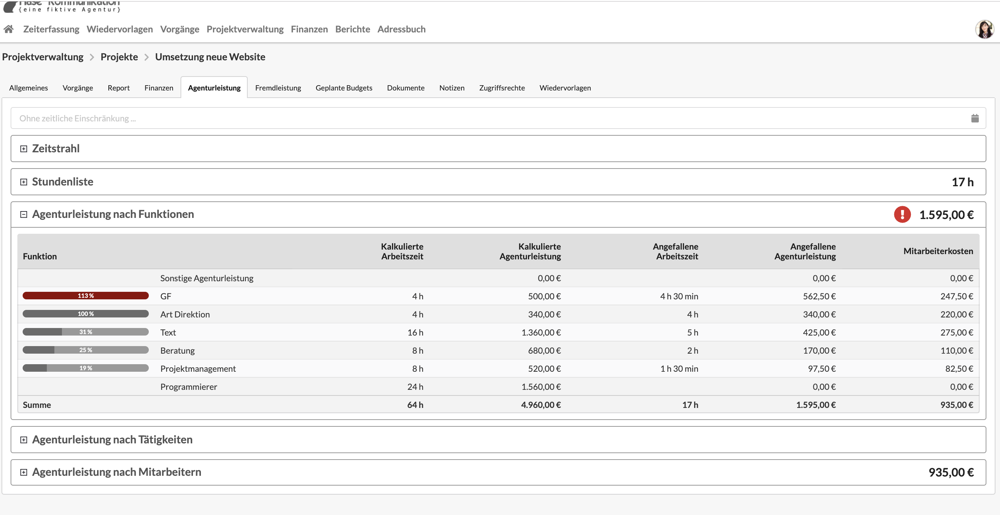

# Funktionen

Funktionen entsprechen den Gewerken - z.B. "Grafik Design", "Senior Beratung", "Programmierung" - mit denen die Agentur ihre Leistungen erbringt.

Sie sind ein zentrales Element der Agenturverwaltung, da sie sowohl die Grundlage zur Erstellung von Agenturleistungspositionen in KVAs und Rechnungen darstellen als auch bei der Zeiterfassung wichtig sind.

Allgemeine Informationen zur Agenturpreisliste und zur Konfiguration dieser findet ihr hier:



Bei der Zeiterfassung spielen Funktionen eine wichtige Rolle, da in jedem Zeiterfassungseintrag eine Funktion ausgewählt werden muss. Die Funktion beschreibt dabei, in welcher Rolle z.B. "Grafikdesigner" ein Mitarbeiter die gegenwärtige Aktivität ausübt. 

Die Auswahl der korrekten Funktion ist wichtig, da Funktionen die Basis für das Controlling der Agenturleistungen darstellen. So werden im Projekt-Controlling bspw. im KVA kalkulierte Aufwände je Funktion den durch Projektmitarbeitern erfassten Aufwänden gegenüber gestellt.

In einigen Fällen stehen einem Mitarbeiter zwei oder mehr Funktionen zur Auswahl, sodass bspw. ein Creative Director je nach Art der Aufgabe zwischen unterschiedlich bepreisten Funktionen wie z.B. "Art Direktion", "Grafikdesign" auswählen kann. 

Einem Benutzer kann aber auch nur eine Funktion zugewiesen werden. Dann entfällt die Auswahl. Die Zuordnung von Funktionen zu Benutzern und Benutzergruppen findet in den Benutzereinstellungen statt.



