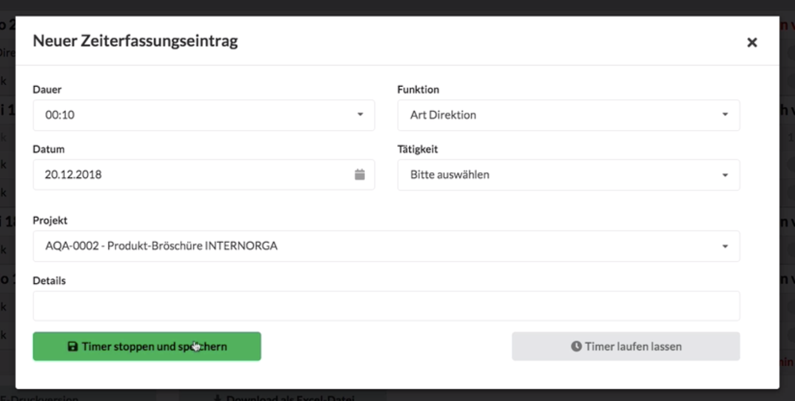
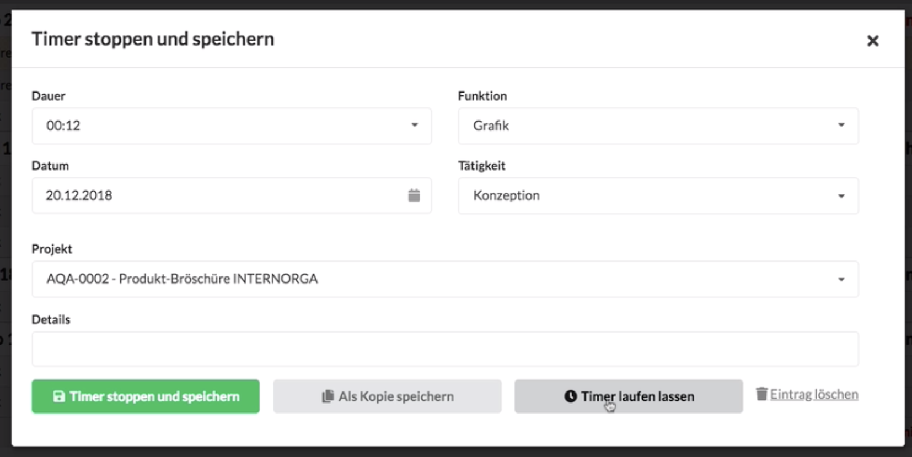

# Timer

Das ist vor allem sinnvoll, wenn wir viel zwischen unterschiedlichen Projekten hin und her springen und unsere Zeiten möglichst exakt erfassen wollen.

Ein Timer ist eine Stoppuhr, die jeder Benutzer für sich laufen lassen kann, um seine Arbeitszeit zu erfassen. Der Timer kann auf verschiedene Weise gestartet werden.

Wenn wir mit einer neuen Tätigkeit beginnen, können wir den Timer einfach aus dem Menü starten. Wir sehen dann im Menü, dass gerade ein Timer im Hintergrund läuft. Diese Seite können wir dann verlassen und später zurückkehren.   

Zu einem späteren Zeitpunkt stoppen wir den Timer einfach aus dem Hauptmenü heraus. Es öffnet sich ein Dialog, in dem wir Projekt, Funktion und weitere Details angeben können. Anschliessend speichern wir den Eintrag.  

Wir können den Timer auch direkt aus der Zeiterfassungsliste starten, indem wir auf die Schaltfläche "Start" drücken.

Über die Schaltfläche "Stop" beenden wir den Timer und können ggf. weitere Details für die Zeiterfassung ergänzen. Abschliessend speichern wir den Eintrag.

## Weitere Tipps:

* Wir können auch einen Eintrag in der Liste öffnen und den Timer für diesen Eintrag dann erneut starten.
* Bei einem laufenden Eintrag können wir auch eine Änderung vornehmen. Dazu verwenden wir den Button "Timer weiterlaufen lassen" im Detail-Dialog.  

  

* Wenn wir die Start-Taste an einem Eintrag betätigen, der nicht von heutigen Tag ist, wird durch das Starten des Timers eine Kopie des Eintrags mit dem heutigen Datum erstellt. Auf diese Weisen können Projektmitarbeiter komfortabel an den Aufgaben des Vortags weiterarbeiten, ohne Informationen wie Projektname oder Funktion erneut eingeben zu müssen.

